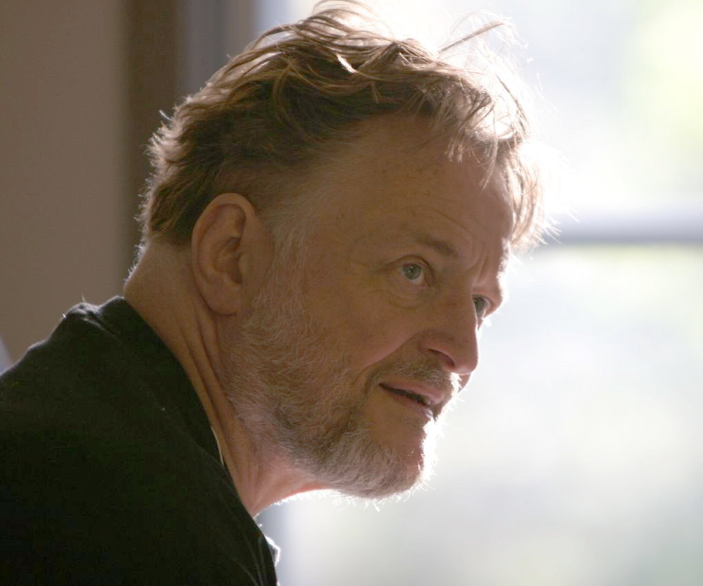
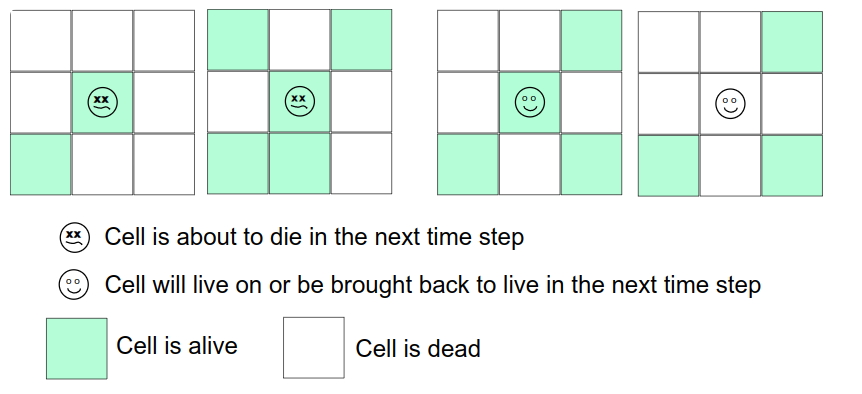
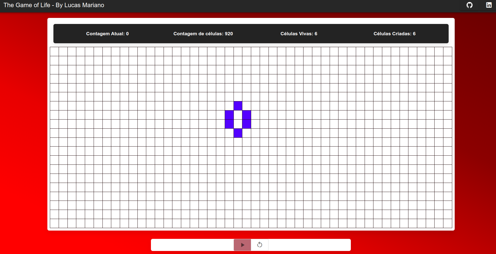

# The Game of Life

## Context

The Game of Life, also known simply as Life, is a cellular automaton devised by the British mathematician John Horton Conway in 1970. It is a playerless game, meaning your evolution is determined by your starting state, with no additional input required. You interact with the Game of Life by creating an initial configuration and watching how it evolves. It is Turing complete and can simulate a universal constructor or any other Turing machine.

## Rules

In the Game of Life each grid cell can have either one of two states: dead or alive. The Game of Life is controlled by four simple rules which are applied to each grid cell in the simulation domain:

- A live cell dies if it has fewer than two live neighbors.
- A live cell with two or three live neighbors lives on to the next generation.
- A live cell with more than three live neighbors dies.
- A dead cell will be brought back to live if it has exactly three live neighbors.

## Implementing the game of life with code

In this repository you will find my implementation of the game of life in the following languages: Python and Javascript (Vuejs). I hope you like it and have fun if you are also thinking about implementing the game of life with programming!

